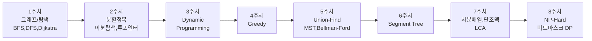

# 알고리즘 교육 자료 (1~8주차)

> **누구를 위한 자료인가요?**
> C++ 문법은 이미 알지만 알고리즘은 처음 배우는 17세 학생들. 그래프의 정점/간선/가중치 같은 기본 용어는 알고 있다고 가정합니다.
>
> **목표**: 코딩 테스트에서 만나는 핵심 알고리즘을 "감"이 아니라 "원리 + 손코딩"으로 익히기.

---

## 학습 흐름 한눈에 보기



큰 그림은 **"탐색 → 효율적 탐색 → 메모이제이션 → 자료구조 트릭 → 그래도 어려운 문제"** 입니다.
앞 주차를 모르면 뒤 주차가 막히기 때문에 **순서대로** 보세요.

---

## 주차별 목차

| 주차 | 핵심 주제 | 자료 링크 |
|------|----------|----------|
| 1주차 | 그래프/트리 표현, Stack, Queue, Recursion, BFS, DFS, Backtracking, Dijkstra | [week1 README](./week1_graph_bfs_dfs_dijkstra/README.md) |
| 2주차 | Divide & Conquer, Merge Sort, Binary Search, Two-Pointer | [week2 README](./week2_divide_conquer_merge_binary_two_pointer/README.md) |
| 3주차 | Dynamic Programming (메모이제이션, 타뷸레이션, LIS, 0/1 배낭, LCS) | [week3 README](./week3_dynamic_programming/README.md) |
| 4주차 | Greedy (동전, 회의실 배정, 분수 배낭) | [week4 README](./week4_greedy/README.md) |
| 5주차 | Union-Find, Kruskal MST, Prim MST, Bellman-Ford | [week5 README](./week5_unionfind_mst_bellmanford/README.md) |
| 6주차 | Segment Tree (구간합, 최대/최소, Lazy Propagation) | [week6 README](./week6_segment_tree/README.md) |
| 7주차 | Difference Array, Monotonic Deque, LCA | [week7 README](./week7_difference_deque_lca/README.md) |
| 8주차 | General NP-Hard (P/NP, 백트래킹, 비트마스크 DP TSP, 근사) | [week8 README](./week8_np_hard/README.md) |

---

## 자료 구성 방식 — 모든 알고리즘에 다음이 들어 있습니다

1. **30초 요약** — 한 문단 핵심 정리.
2. **일상 비유** — "이 알고리즘은 ~하는 것과 같아요" 한 문장.
3. **시각화** — Mermaid 다이어그램 또는 ASCII 그림.
4. **동작 원리** — 단계별 설명.
5. **C++ 코드** — `g++ -std=c++17 -Wall`로 그대로 컴파일되는 완전한 프로그램, 한국어 주석 듬뿍.
6. **시간/공간 복잡도** — 빅오 표기 + "왜 이런 복잡도인지" 설명.
7. **자주 하는 실수** — 최소 2개의 함정 포인트.
8. **연습문제** — 최소 2개의 BOJ/프로그래머스 문제 또는 손풀이 예제.

---

## 시각화 정책

### 1순위 — Mermaid 다이어그램
GitHub, VSCode, Obsidian 등 대부분의 마크다운 뷰어에서 자동 렌더링됩니다.
별도 설치 없이 README를 열면 그래프/플로우차트/시퀀스가 그림으로 보입니다.

### 2순위 — ASCII 박스 그림
배열 인덱스 변화, DP 테이블, 두 포인터 위치, 단조 덱 상태 등은 ASCII 박스로 단계별로 보여줍니다.

### 3순위 — 외부 이미지 생성용 프롬프트
[`images/prompts/`](./images/prompts) 폴더에 알고리즘별로 영어 프롬프트 텍스트 파일이 있습니다.
이 파일을 그대로 **gpt-image-2** 또는 **Gemini Nano Banana**에 붙여 넣으면 일러스트가 생성됩니다.
생성한 이미지는 `images/` 폴더에 같은 이름(`weekN_<algo>.png`)으로 저장하고,
필요하면 README에 직접 임베드해 사용하세요.

```
educational_materials/
├── README.md              ← 이 파일 (마스터 인덱스)
├── images/
│   └── prompts/           ← 31개의 영어 이미지 프롬프트
├── scripts/
│   └── compile_check.sh   ← 모든 cpp 스니펫 자동 컴파일 검증
└── weekN_*/
    └── README.md          ← 주차별 본문
```

---

## 이 자료 사용법

### 학습자
1. **순서대로** 1주차부터 8주차까지.
2. 각 주차의 C++ 코드를 직접 타이핑해서 컴파일 → 실행 → 출력 확인.
3. "자주 하는 실수" 부분을 두 번 읽기. 진짜로 실수합니다.
4. "연습문제" 중 최소 1문제는 **시간 재고** 풀어보기.

### 강사
- 한 주차당 60~90분 강의 분량을 가정하고 작성됨.
- "30초 요약"으로 도입, "시각화"로 직관, "C++ 코드"로 손코딩, "자주 하는 실수"로 마무리.
- 학생이 점화식/그리디 정당성을 못 세우는 순간이 곧 그 학생의 성장 포인트입니다.

### 코드 검증
모든 C++ 스니펫이 컴파일되는지 한 번에 확인:
```bash
bash ClassNote/educational_materials/scripts/compile_check.sh
```
정상이면 종료 코드 0, 실패한 스니펫이 있으면 어디가 문제인지 출력합니다.

---

## 이 자료에서 *다루지 않는* 것

- 알고리즘 정확성에 대한 형식적 증명(귀납법 풀이 등)
- 자료구조의 학술적 기원
- 분할상환 분석(Amortized analysis) 같은 고급 분석

> "현학적인 자료구조의 기원, 알고리즘 증명 등을 모두 생략하고 오로지 코테를 통과한다는 것을 목표로 달립니다."
> — 본 레포지토리 README

대신 "이 알고리즘이 왜 옳은가"에 대한 직관(예: 그리디의 교환 논법)은 짧게라도 항상 함께 설명합니다.

---

## 문제가 생기면

- C++ 코드가 컴파일 안 됨 → `compile_check.sh` 실행해서 정확한 에러 메시지 확인
- Mermaid가 안 보임 → 마크다운 뷰어가 Mermaid를 지원하는지 확인 (GitHub 웹은 기본 지원)
- 이미지가 안 보임 → `images/prompts/` 의 텍스트 파일을 직접 열어서 영어 프롬프트로 이미지 생성

즐거운 알고리즘 공부 되세요.
