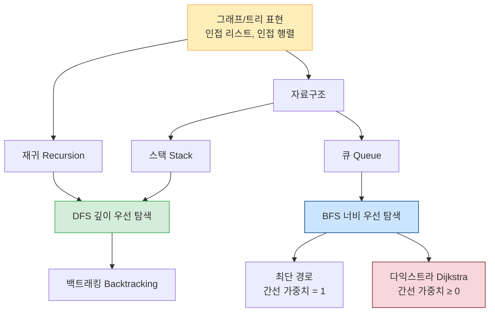
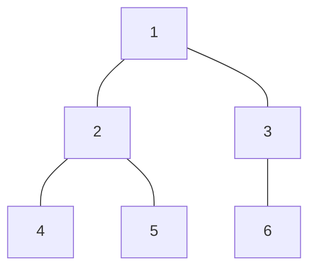
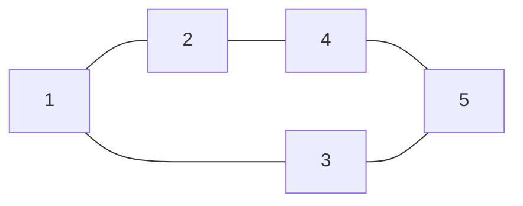
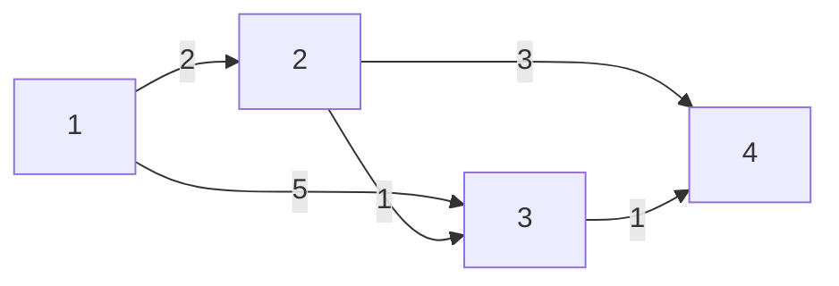

# 1주차 — 그래프/트리, 스택, 큐, 재귀, BFS, DFS, 백트래킹, 다익스트라

---

## 들어가며

이번 주에는 알고리즘의 세계에서 가장 자주 등장하는 **그래프 탐색** 패밀리를 배웁니다. 여러분은 이미 C++ 문법을 알고 있고, 정점/간선/방향 그래프/비방향 그래프/가중치 같은 기본 용어도 알고 있으니까, 이제 "이걸 코드로 어떻게 표현하고, 어떻게 탐색하느냐"를 집중적으로 익힐 차례입니다. 처음엔 개념이 많아 보여서 겁날 수 있는데, 사실 스택·큐·재귀 세 가지 도구를 이해하면 DFS/BFS/백트래킹/다익스트라 모두 자연스럽게 연결됩니다.

왜 이게 중요하냐고요? 백준·코드포스·리트코드 문제의 절반 이상이 그래프 탐색 기반입니다. 지도에서 최단 경로를 찾거나, SNS에서 친구 추천을 하거나, 게임 AI가 길을 찾는 것도 전부 이 알고리즘들이 핵심입니다. 지금 이 주차를 탄탄히 다져 두면, 나중에 나오는 DP·유니온 파인드·세그먼트 트리 같은 고급 주제도 훨씬 쉽게 느껴질 거예요.

학습 순서는 다음과 같습니다. 먼저 그래프를 **메모리에 저장하는 법**(인접 리스트/행렬)을 배우고, 탐색에 필요한 **자료구조**(스택, 큐)를 익힙니다. 그 다음 **재귀** 사고방식을 연습한 뒤, 재귀+스택으로 만드는 **DFS**, 큐로 만드는 **BFS**, 그리고 DFS를 확장한 **백트래킹**, 마지막으로 가중치까지 다루는 **다익스트라**로 나아갑니다. 순서대로 읽으면 각 개념이 앞 개념 위에 자연스럽게 쌓입니다.

---

## 주제 연결 지도



---

## 1. 그래프와 트리 표현

> 그래프를 코드로 다루려면 먼저 메모리에 저장해야 합니다. 가장 흔한 방법 두 가지 — **인접 리스트**와 **인접 행렬** — 를 비교해서 익혀 봅시다.

### 1.1 인접 리스트 (Adjacency List)

각 정점마다 "연결된 이웃 목록"을 저장합니다. C++에서는 `vector<vector<int>>` 또는 `vector<vector<pair<int,int>>>`(가중치 포함)를 사용합니다.

```cpp
// 예시: 5개 정점, 비방향 그래프
#include <bits/stdc++.h>
using namespace std;

int main() {
    int n = 5; // 정점 수 (1-indexed 사용)
    vector<vector<int>> adj(n + 1); // adj[v] = v와 연결된 정점 목록

    // 간선 추가 (비방향 → 양쪽에 모두 추가)
    auto addEdge = [&](int u, int v) {
        adj[u].push_back(v);
        adj[v].push_back(u);
    };

    addEdge(1, 2);
    addEdge(1, 3);
    addEdge(2, 4);
    addEdge(3, 5);

    // 인접 리스트 출력
    for (int v = 1; v <= n; v++) {
        cout << v << " -> ";
        for (int u : adj[v]) cout << u << " ";
        cout << "\n";
    }
    // 출력:
    // 1 -> 2 3
    // 2 -> 1 4
    // 3 -> 1 5
    // 4 -> 2
    // 5 -> 3
    return 0;
}
```

**가중치 그래프**는 `pair<int,int>`로 (이웃 정점, 가중치)를 저장합니다.

```cpp
#include <bits/stdc++.h>
using namespace std;

int main() {
    int n = 4;                                  // 정점 수
    // wadj[u] = { (v, w), (v', w'), ... }     // u에서 갈 수 있는 (이웃, 가중치) 목록
    vector<vector<pair<int,int>>> wadj(n + 1);
    wadj[1].push_back({2, 5});                  // 1 --(5)--> 2
    wadj[1].push_back({3, 2});                  // 1 --(2)--> 3
    wadj[2].push_back({4, 1});                  // 2 --(1)--> 4
    wadj[3].push_back({4, 7});                  // 3 --(7)--> 4

    // 출력: 각 정점의 이웃과 가중치
    for (int u = 1; u <= n; ++u) {
        cout << u << " -> ";
        for (auto [v, w] : wadj[u]) cout << "(" << v << ", w=" << w << ") ";
        cout << "\n";
    }
    return 0;
}
```

**시간/공간**: 정점 V개, 간선 E개일 때 공간 O(V + E). 특정 간선 존재 여부 확인은 O(degree).

---

### 1.2 인접 행렬 (Adjacency Matrix)

V×V 2차원 배열에 간선 여부(또는 가중치)를 저장합니다.

```cpp
#include <bits/stdc++.h>
using namespace std;

int main() {
    int n = 5;
    // mat[u][v] = 1이면 u→v 간선 존재, 0이면 없음
    vector<vector<int>> mat(n + 1, vector<int>(n + 1, 0));

    auto addEdge = [&](int u, int v) {
        mat[u][v] = 1;
        mat[v][u] = 1; // 비방향 그래프
    };

    addEdge(1, 2); addEdge(1, 3);
    addEdge(2, 4); addEdge(3, 5);

    // 행렬 출력
    cout << "   ";
    for (int j = 1; j <= n; j++) cout << j << " ";
    cout << "\n";
    for (int i = 1; i <= n; i++) {
        cout << i << ": ";
        for (int j = 1; j <= n; j++) cout << mat[i][j] << " ";
        cout << "\n";
    }
    return 0;
}
```

**시간/공간**: 공간 O(V²). 특정 간선 존재 여부 확인은 O(1). 정점이 많고 간선이 적으면(희소 그래프) 메모리 낭비가 크므로 **보통 인접 리스트를 선호**합니다.

---

### 1.3 트리 (Tree)

**트리 = 사이클이 없는 연결 그래프**. 정점이 V개이면 간선은 정확히 V-1개입니다.



- 루트(root): 트리의 최상단 정점 (보통 1번)
- 부모(parent) / 자식(child): 루트 방향 / 루트 반대 방향 이웃
- 리프(leaf): 자식이 없는 정점
- 깊이(depth): 루트에서 해당 정점까지의 간선 수

트리는 그래프의 특수한 경우이므로, DFS/BFS 모두 그대로 적용됩니다.

경쟁 프로그래밍에서 트리는 **부모 배열(parent array)**로 저장하고 재귀 DFS로 서브트리 크기를 구하는 패턴이 자주 등장합니다.

```cpp
#include <bits/stdc++.h>
using namespace std;

// 트리: 루트=1, n개 정점, parent 배열로 저장
// subtreeSize[v] = v를 루트로 하는 서브트리의 정점 수
vector<vector<int>> children; // children[v] = v의 자식 목록
vector<int> subtreeSize;

// 루트에서 DFS: parent 배열 → children 구조 변환 후 크기 계산
int dfsSize(int v) {
    subtreeSize[v] = 1; // 자신 포함
    for (int c : children[v]) {
        subtreeSize[v] += dfsSize(c); // 각 자식 서브트리 크기 합산
    }
    return subtreeSize[v];
}

int main() {
    int n = 6; // 정점 1~6, 루트=1
    // parent[v] = v의 부모 (루트는 0으로 표시)
    vector<int> parent = {0, 0, 1, 1, 2, 2, 3}; // 1-indexed, parent[1]=0(루트)

    children.assign(n + 1, {});
    for (int v = 2; v <= n; v++) {
        children[parent[v]].push_back(v); // 부모→자식 연결
    }

    subtreeSize.assign(n + 1, 0);
    dfsSize(1); // 루트 1에서 시작

    for (int v = 1; v <= n; v++) {
        cout << "subtreeSize[" << v << "] = " << subtreeSize[v] << "\n";
    }
    // 출력 예: subtreeSize[1]=6, subtreeSize[2]=3, subtreeSize[3]=2, ...
    return 0;
}
```

---

## 2. 스택 (Stack)

> **30초 요약**: 스택은 **LIFO(Last In, First Out)** 자료구조입니다. 가장 나중에 넣은 것을 가장 먼저 꺼냅니다. DFS 구현, 괄호 매칭, 함수 콜 스택 시뮬레이션 등에 활용됩니다.

### 일상 비유

식당 주방에 쌓여 있는 **접시 더미**를 상상해 보세요. 새 접시는 맨 위에 올리고, 사용할 접시도 맨 위에서 꺼냅니다. 중간 접시를 직접 꺼낼 수 없고, 반드시 위에서부터 순서대로 꺼내야 합니다.

### 시각화

```
push(1) push(2) push(3)    pop()    pop()
  [3]                →  [2]    →  [1]
  [2]                   [1]       
  [1]                   
TOP ↑                TOP ↑     TOP ↑
```

### 동작 원리 — 단계별

1. `push(x)`: 스택 맨 위에 x를 올린다.
2. `pop()`: 스택 맨 위 원소를 제거하고 반환한다. (비어 있으면 undefined behavior — 항상 `empty()` 확인!)
3. `top()`: 맨 위 원소를 제거하지 않고 확인만 한다.
4. `empty()`: 스택이 비어 있는지 확인한다.
5. `size()`: 스택에 쌓인 원소 수를 반환한다.

### C++ 코드

```cpp
#include <bits/stdc++.h>
using namespace std;

int main() {
    stack<int> stk; // std::stack 선언

    // ---- 기본 연산 시연 ----
    stk.push(10); // 스택: [10]
    stk.push(20); // 스택: [10, 20]  ← 20이 맨 위
    stk.push(30); // 스택: [10, 20, 30]

    cout << "현재 top: " << stk.top() << "\n"; // 30 출력

    stk.pop(); // 30 제거 → 스택: [10, 20]
    cout << "pop 후 top: " << stk.top() << "\n"; // 20 출력

    // ---- 실용 예제: 올바른 괄호 검사 ----
    // '(' 를 만나면 push, ')' 를 만나면 pop (짝이 맞는지 확인)
    string s = "((()()))";
    stack<char> paren;
    bool valid = true;

    for (char c : s) {
        if (c == '(') {
            paren.push(c); // 열리는 괄호는 스택에 쌓기
        } else if (c == ')') {
            if (paren.empty()) {
                // 대응할 '('가 없으면 잘못된 괄호
                valid = false;
                break;
            }
            paren.pop(); // 가장 최근에 열린 괄호와 매칭
        }
    }
    // 스택이 남아 있으면 닫히지 않은 '('가 있다는 뜻
    if (!paren.empty()) valid = false;

    cout << "\"" << s << "\" 올바른 괄호? " << (valid ? "예" : "아니오") << "\n";

    // ---- 전체를 꺼내며 출력 ----
    cout << "스택에 남은 원소 (top→bottom): ";
    while (!stk.empty()) {
        cout << stk.top() << " "; // top 확인
        stk.pop();                // 꺼내기
    }
    cout << "\n";

    return 0;
}
```

### 시간/공간 복잡도

- 시간: push/pop/top/empty 모두 **O(1)**
- 공간: O(n) — n개의 원소를 저장

`std::stack`은 내부적으로 `std::deque`를 기반으로 구현되어 있으며, 각 연산이 상수 시간에 수행됩니다. n번의 push/pop이 있다면 전체 시간은 O(n)입니다.

### 자주 하는 실수

- **`empty()` 확인 없이 `pop()`/`top()` 호출**: 스택이 비어 있을 때 `top()`이나 `pop()`을 호출하면 런타임 에러(undefined behavior)가 발생합니다. 반드시 `if (!stk.empty())` 로 확인하세요.
- **`pop()`이 값을 반환하지 않는다고 착각**: C++의 `std::stack::pop()`은 값을 반환하지 않습니다. 값이 필요하면 `top()`으로 먼저 읽은 뒤 `pop()`을 호출하세요.
- **스택 대신 일반 배열을 수동으로 관리하려다 인덱스 실수**: STL `stack`을 쓰면 인덱스 관리가 필요 없어 버그가 줄어듭니다.

### 연습문제

- BOJ 10828 — 스택
- BOJ 9012 — 괄호
- BOJ 17298 — 오큰수 (스택 응용: 다음 큰 원소 찾기)

---

## 3. 큐 (Queue)

> **30초 요약**: 큐는 **FIFO(First In, First Out)** 자료구조입니다. 가장 먼저 넣은 것을 가장 먼저 꺼냅니다. BFS 구현의 핵심이며, 프린터 대기열·네트워크 패킷 처리 등에서도 쓰입니다.

### 일상 비유

마트 계산대 줄을 생각해 보세요. 가장 먼저 줄을 선 사람이 가장 먼저 계산을 마치고 나갑니다. 새로 온 사람은 맨 뒤에 줄을 서야 하고, 중간에 끼어들 수 없습니다. 이것이 큐입니다.

### 시각화

```
enqueue →  [1][2][3]  → dequeue
           앞(front)      뒤(back)

push_back(4) 후: [1][2][3][4]
pop_front()  후: [2][3][4]      (1이 나감)
```

### 동작 원리 — 단계별

1. `push(x)` (= enqueue): 큐의 맨 뒤에 x를 추가한다.
2. `pop()` (= dequeue): 큐의 맨 앞 원소를 제거한다. (비어 있으면 undefined behavior)
3. `front()`: 맨 앞 원소를 확인한다 (제거하지 않음).
4. `back()`: 맨 뒤 원소를 확인한다.
5. `empty()`: 큐가 비어 있는지 확인한다.

### C++ 코드

```cpp
#include <bits/stdc++.h>
using namespace std;

int main() {
    queue<int> q; // std::queue 선언

    // ---- 기본 연산 시연 ----
    q.push(10); // 큐: [10]
    q.push(20); // 큐: [10, 20]
    q.push(30); // 큐: [10, 20, 30]

    cout << "front: " << q.front() << "\n"; // 10 출력 (먼저 들어온 것)
    cout << "back:  " << q.back()  << "\n"; // 30 출력 (나중에 들어온 것)

    q.pop(); // 10 제거 → 큐: [20, 30]
    cout << "pop 후 front: " << q.front() << "\n"; // 20

    // ---- 실용 예제: 은행 번호표 시뮬레이션 ----
    // 고객이 순서대로 번호를 뽑고 순서대로 서비스를 받는다
    queue<string> customers;
    customers.push("김철수"); // 1번
    customers.push("이영희"); // 2번
    customers.push("박지민"); // 3번

    cout << "\n--- 은행 서비스 순서 ---\n";
    int order = 1;
    while (!customers.empty()) {
        // 항상 empty() 체크 후 front()/pop() 사용
        cout << order++ << "번: " << customers.front() << "\n";
        customers.pop();
    }
    // 출력: 1번: 김철수, 2번: 이영희, 3번: 박지민

    return 0;
}
```

### 시간/공간 복잡도

- 시간: push/pop/front/back/empty 모두 **O(1)**
- 공간: O(n)

`std::queue`는 내부적으로 `std::deque`로 구현됩니다. 앞에서 꺼내고(deque의 pop_front) 뒤에서 넣는(push_back) 연산 모두 상수 시간입니다.

### 자주 하는 실수

- **`front()` 없이 `pop()` 만 호출해서 값을 잃어버림**: 큐에서 값을 꺼내 쓰려면 `front()`로 읽고 난 다음 `pop()`으로 제거해야 합니다.
- **BFS에서 방문 표시를 큐에서 꺼낼 때 한다**: 올바른 BFS는 **큐에 넣을 때** `visited[next] = true`를 설정해야 합니다. 꺼낼 때 표시하면 같은 정점이 여러 번 큐에 들어가 비효율이 생깁니다.
- **`std::queue`와 `std::deque` 혼동**: BFS에는 `queue`, 앞뒤 모두 삽입/삭제가 필요하면 `deque`를 씁니다.

### 연습문제

- BOJ 10845 — 큐
- BOJ 1158 — 요세푸스 문제 (큐로 시뮬레이션)
- BOJ 2164 — 카드2

---

## 4. 재귀 (Recursion)

> **30초 요약**: 재귀는 **함수가 자기 자신을 호출**하는 프로그래밍 기법입니다. 반드시 **종료 조건(base case)**이 있어야 무한 루프에 빠지지 않습니다. 복잡한 문제를 "더 작은 같은 종류의 문제"로 쪼개는 강력한 사고방식입니다.

### 일상 비유

러시아 인형 **마트료시카**를 생각해 보세요. 큰 인형을 열면 똑같이 생긴 작은 인형이 있고, 또 열면 더 작은 인형이 있습니다. 언젠가는 더 이상 열 수 없는 가장 작은 인형(종료 조건)이 나옵니다. 재귀 함수도 마찬가지입니다 — 문제를 작은 버전의 같은 문제로 계속 쪼개다가, 더 이상 쪼갤 수 없는 가장 작은 문제에서 멈춥니다.

### 시각화

```
factorial(4) 호출
  └─ 4 * factorial(3)
         └─ 3 * factorial(2)
                └─ 2 * factorial(1)
                       └─ 1 * factorial(0)   ← base case: 반환 1
                       ← 1 * 1 = 1
                ← 2 * 1 = 2
         ← 3 * 2 = 6
  ← 4 * 6 = 24
```

**콜 스택(Call Stack) 비유**: 함수를 호출할 때마다 컴퓨터는 "지금 하던 작업을 잠깐 접시 더미(스택)에 올려 두고" 새 함수를 실행합니다. 함수가 리턴하면 스택에서 꺼내 이전 작업을 재개합니다. 재귀가 너무 깊어지면 스택이 꽉 차서 **Stack Overflow** 에러가 납니다. C++의 기본 스택 크기는 약 8MB이며, `int` 지역 변수 몇 개를 쓰는 함수 프레임 기준으로 재귀 깊이가 약 10^5~10^6 수준에서 위험합니다.

### 동작 원리 — 단계별

1. **종료 조건(base case)** 확인: 더 이상 재귀 호출이 필요 없는 가장 작은 입력에서 바로 값을 반환한다.
2. **재귀 호출(recursive case)**: 문제를 더 작은 입력에 대한 같은 함수 호출로 표현한다.
3. **반환값 조합**: 재귀 호출에서 받은 결과를 조합해 현재 단계의 답을 만든다.
4. 호출이 완료되면 콜 스택에서 이전 호출로 자동으로 돌아간다.

### C++ 코드

```cpp
#include <bits/stdc++.h>
using namespace std;

// ---- 예제 1: 팩토리얼 ----
// n! = n * (n-1)! 로 정의. 0! = 1 이 base case.
long long factorial(int n) {
    if (n == 0) return 1; // base case: 더 이상 쪼갤 수 없는 가장 작은 경우
    return (long long)n * factorial(n - 1); // 재귀 호출: n보다 1 작은 문제로 위임
}

// ---- 예제 2: 피보나치 수 (재귀 버전 — 효율은 나쁘지만 이해용) ----
// fib(n) = fib(n-1) + fib(n-2), base case: fib(0)=0, fib(1)=1
int fib(int n) {
    if (n <= 1) return n; // base case
    return fib(n - 1) + fib(n - 2); // 두 개의 재귀 호출
    // 주의: 이 구현은 중복 계산이 많아 n이 크면 매우 느림 (지수 시간)
    // 메모이제이션(배열에 결과 저장)을 추가하면 O(n)으로 개선 가능 — 지금은 재귀 이해가 목표
}

// ---- 예제 3: 재귀로 배열 합 구하기 ----
// sum(arr, 0, n) = arr[0] + sum(arr, 1, n)
int sumArray(vector<int>& arr, int idx) {
    if (idx == (int)arr.size()) return 0; // base case: 끝에 도달
    return arr[idx] + sumArray(arr, idx + 1); // 나머지의 합에 현재 원소 더하기
}

int main() {
    // 팩토리얼 테스트
    for (int i = 0; i <= 6; i++) {
        cout << i << "! = " << factorial(i) << "\n";
    }
    // 출력: 0!=1, 1!=1, 2!=2, 3!=6, 4!=24, 5!=120, 6!=720

    cout << "\n피보나치 수열 (n=0..9): ";
    for (int i = 0; i < 10; i++) {
        cout << fib(i) << " ";
    }
    cout << "\n";
    // 출력: 0 1 1 2 3 5 8 13 21 34

    vector<int> arr = {3, 7, 1, 5, 2};
    cout << "\n배열 합: " << sumArray(arr, 0) << "\n"; // 18

    return 0;
}
```

### 시간/공간 복잡도

- **팩토리얼**: 시간 O(n), 공간 O(n) — 재귀 호출이 n번, 콜 스택 깊이도 n
- **단순 피보나치(재귀)**: 시간 O(2^n) (더 정확히는 O(φ^n), φ ≈ 1.618) — 같은 값을 지수적으로 중복 계산. n=40만 넘어도 몇 초가 걸립니다.
- 재귀의 공간 복잡도는 보통 **재귀 깊이** = 콜 스택 깊이만큼입니다. C++ 기본 스택 크기는 보통 1~8MB 정도라, 재귀 깊이가 수십만을 넘으면 스택 오버플로가 발생합니다.

### 자주 하는 실수

- **base case를 빠뜨리거나 잘못 설정**: 가장 흔한 실수입니다. `factorial(-1)`을 호출하면 무한 재귀에 빠집니다. 입력 범위와 종료 조건을 항상 명확히 하세요.
- **재귀가 너무 깊어 스택 오버플로**: n=100,000 규모의 DFS 등에서 발생할 수 있습니다. 이 경우 스택을 명시적으로 사용하는 반복 버전으로 전환하는 것이 안전합니다.
- **중복 계산**: 피보나치처럼 같은 입력으로 여러 번 호출되는 재귀는 메모이제이션(DP)으로 최적화해야 합니다.

### 연습문제

- BOJ 10872 — 팩토리얼
- BOJ 24060 — 알고리즘 수업 - 병합 정렬 1 (재귀 흐름 추적)
- BOJ 17478 — 재귀함수가 뭔가요?

---

## 5. DFS (Depth-First Search, 깊이 우선 탐색)

> **30초 요약**: DFS는 그래프에서 **한 방향으로 최대한 깊이 들어갔다가, 막히면 되돌아와서 다음 경로를 탐색**하는 알고리즘입니다. 재귀(콜 스택)로 구현하거나, 명시적 스택으로 구현할 수 있습니다. 연결 요소 판별, 위상 정렬, 백트래킹의 기반이 됩니다.

### 일상 비유

미로 탐험을 상상해 보세요. 갈림길에서 항상 **왼쪽 길**을 먼저 선택해서 최대한 깊이 들어갑니다. 막다른 곳에 도달하면 직전 갈림길로 **되돌아와(backtrack)** 다음 길을 시도합니다. 미로의 모든 곳을 방문할 때까지 이 과정을 반복합니다.

### 시각화

```
그래프 (간선: 1-2, 1-3, 2-4, 4-5, 3-5):

    1
   / \
  2   3
  |   |
  4   |
   \ /
    5

DFS 탐색 순서 (시작=1, 이웃을 번호 순으로 방문):
1 방문
└─ 2 방문
│  └─ 4 방문
│     └─ 5 방문  (5의 이웃: 3(미방문), 4(방문됨))
│        └─ 3 방문
방문 순서: 1 → 2 → 4 → 5 → 3
```



### 동작 원리 — 단계별

1. 시작 정점을 방문 처리하고 스택(또는 콜 스택)에 넣는다.
2. 현재 정점의 미방문 이웃 중 하나를 선택해 방문 처리 후 재귀(또는 스택에 push)한다.
3. 미방문 이웃이 없으면 현재 정점에서 되돌아간다(재귀 return / 스택 pop).
4. 스택이 빌 때까지 (또는 모든 정점을 방문할 때까지) 2~3을 반복한다.

### C++ 코드

```cpp
#include <bits/stdc++.h>
using namespace std;

// ============================================================
// 버전 1: 재귀 DFS (가장 직관적인 구현)
// ============================================================
void dfsRecursive(int v, vector<vector<int>>& adj, vector<bool>& visited) {
    visited[v] = true;               // 현재 정점 방문 표시
    cout << v << " ";                // 방문 출력

    for (int next : adj[v]) {        // v의 모든 이웃에 대해
        if (!visited[next]) {        // 아직 방문하지 않은 이웃만
            dfsRecursive(next, adj, visited); // 재귀 호출로 더 깊이 탐색
        }
    }
    // 이 함수가 return되면 → 이전 정점으로 자동으로 되돌아감 (백트래킹)
}

// ============================================================
// 버전 2: 명시적 스택 DFS (반복 버전)
// 재귀 깊이 제한이 걱정될 때 사용
// ============================================================
void dfsIterative(int start, vector<vector<int>>& adj, int n) {
    vector<bool> visited(n + 1, false);
    stack<int> stk;

    stk.push(start);    // 시작 정점을 스택에 넣기
    visited[start] = true;

    while (!stk.empty()) {
        int v = stk.top(); // 스택 맨 위를 현재 정점으로 선택
        stk.pop();
        cout << v << " "; // 방문 출력

        // 이웃을 역순으로 push해야 원하는 순서대로 방문됨
        // (스택은 LIFO이므로 마지막에 push한 것이 먼저 나옴)
        for (int i = (int)adj[v].size() - 1; i >= 0; i--) {
            int next = adj[v][i];
            if (!visited[next]) {
                visited[next] = true;
                stk.push(next);
            }
        }
    }
}

int main() {
    int n = 5; // 정점 수
    vector<vector<int>> adj(n + 1);

    // 비방향 그래프 간선 추가
    auto addEdge = [&](int u, int v) {
        adj[u].push_back(v);
        adj[v].push_back(u);
    };
    addEdge(1, 2);
    addEdge(1, 3);
    addEdge(2, 4);
    addEdge(4, 5);
    addEdge(3, 5);

    // 이웃 목록을 정렬하면 번호 순서로 방문 (BOJ에서 자주 요구)
    for (int v = 1; v <= n; v++) sort(adj[v].begin(), adj[v].end());

    // ---- 재귀 DFS ----
    cout << "재귀 DFS 방문 순서: ";
    vector<bool> visited1(n + 1, false);
    dfsRecursive(1, adj, visited1);
    cout << "\n";

    // ---- 반복 DFS ----
    cout << "반복 DFS 방문 순서: ";
    dfsIterative(1, adj, n);
    cout << "\n";

    // ---- 연결 요소(Connected Component) 개수 세기 ----
    // 방문되지 않은 정점마다 새 DFS를 시작하면 연결 요소를 구할 수 있음
    int n2 = 7;
    vector<vector<int>> adj2(n2 + 1);
    adj2[1].push_back(2); adj2[2].push_back(1);
    adj2[1].push_back(3); adj2[3].push_back(1);
    adj2[4].push_back(5); adj2[5].push_back(4);
    // 6, 7은 고립 정점

    vector<bool> vis2(n2 + 1, false);
    int components = 0;
    for (int v = 1; v <= n2; v++) {
        if (!vis2[v]) {
            components++;
            dfsRecursive(v, adj2, vis2); // 새 연결 요소 탐색
            cout << "\n";
        }
    }
    cout << "연결 요소 수: " << components << "\n";

    return 0;
}
```

### 시간/공간 복잡도

- 시간: **O(V + E)** — 각 정점은 1번, 각 간선은 최대 2번(비방향) 처리됩니다.
- 공간: **O(V)** — visited 배열 O(V) + 재귀 콜 스택 최대 O(V) (최악: 일직선 그래프)

V개의 정점을 모두 방문하고, 각 간선을 양쪽에서 한 번씩 확인하므로 O(V + E)가 됩니다. 인접 행렬 기반으로 구현하면 O(V²)로 느려지므로, 희소 그래프에서는 인접 리스트를 써야 합니다.

**DFS가 연결 요소를 정확히 구하는 이유**: 한 번의 DFS 호출은 시작 정점에서 도달 가능한 *모든* 정점을 방문합니다. 아직 방문하지 않은 정점마다 새 DFS를 시작하면, 각 호출이 정확히 하나의 연결 요소를 커버하므로 호출 횟수 = 연결 요소 수가 됩니다.

### 자주 하는 실수

- **visited 배열 초기화 잊기**: DFS를 여러 번 호출할 때 visited를 초기화하지 않으면 이전 탐색 결과가 남아 있습니다.
- **무방향 그래프에서 부모를 다시 방문**: 재귀 DFS에서 `adj[v]`에 부모 정점도 포함됩니다. `visited` 체크가 있으면 이미 방문한 부모는 건너뛰므로 무한 루프는 발생하지 않습니다 — visited 체크를 빠뜨리지 않는 것이 핵심입니다.
- **정렬 없이 방문 순서 가정**: BOJ 1260처럼 번호 순서로 방문하라고 명시된 경우, 인접 리스트를 미리 정렬해야 합니다.

### 연습문제

- BOJ 1260 — DFS와 BFS
- BOJ 11724 — 연결 요소의 개수
- BOJ 2667 — 단지번호붙이기 (2D 그리드 DFS)

---

## 6. BFS (Breadth-First Search, 너비 우선 탐색)

> **30초 요약**: BFS는 그래프에서 **시작 정점에서 가까운 정점부터 차례대로 탐색**하는 알고리즘입니다. 큐를 사용하며, 간선의 가중치가 모두 같을 때(또는 1일 때) **최단 거리**를 정확히 구할 수 있습니다.

### 일상 비유

SNS에서 "아는 사람"을 찾는 과정을 생각해 보세요. 먼저 내 직접 친구들(1단계), 그 다음 친구의 친구들(2단계), 그 다음 친구의 친구의 친구들(3단계)... 이렇게 동심원처럼 퍼져나가며 탐색합니다. 이것이 BFS입니다. 특정 사람을 찾으면, 그 사람까지의 "다리 수"가 최단 거리가 됩니다.

### 시각화

```
그래프(BFS 시작=1):
    1
   / \
  2   3
 / \   \
4   5   6

BFS 탐색:
레벨 0: [1]          큐: [1]
레벨 1: [2, 3]       큐: [2, 3]
레벨 2: [4, 5, 6]    큐: [4, 5, 6]

최단 거리: dist[1]=0, dist[2]=1, dist[3]=1, dist[4]=2, dist[5]=2, dist[6]=2
```

### 동작 원리 — 단계별

1. 시작 정점을 큐에 넣고 `visited[start] = true`, `dist[start] = 0` 으로 초기화한다.
2. 큐에서 정점 v를 꺼낸다.
3. v의 모든 이웃 next 중 방문하지 않은 것을 큐에 넣고 `visited[next] = true`, `dist[next] = dist[v] + 1`로 설정한다.
4. 큐가 빌 때까지 2~3을 반복한다.

**핵심 포인트**: 큐에 넣을 때 바로 visited를 표시해야 합니다. 그래야 같은 정점이 큐에 여러 번 들어가는 것을 막을 수 있습니다.

### C++ 코드

```cpp
#include <bits/stdc++.h>
using namespace std;

// BFS 함수: start에서 각 정점까지의 최단 거리를 반환
// 도달할 수 없는 정점은 -1로 표시
vector<int> bfs(int start, vector<vector<int>>& adj, int n) {
    vector<int> dist(n + 1, -1); // dist[v] = start에서 v까지 최단 거리 (-1은 미방문)
    queue<int> q;

    dist[start] = 0;  // 시작점 거리는 0
    q.push(start);    // 시작점을 큐에 넣기

    while (!q.empty()) {
        int v = q.front(); // 큐 맨 앞에서 꺼내기
        q.pop();

        for (int next : adj[v]) {    // v의 모든 이웃 순회
            if (dist[next] == -1) {  // 아직 방문하지 않은 이웃이면
                dist[next] = dist[v] + 1; // 거리 = 현재 정점 거리 + 1
                q.push(next);             // 큐에 추가 (다음에 탐색할 예정)
                // 여기서 바로 dist를 설정하는 것이 핵심!
                // 꺼낼 때 설정하면 같은 정점이 여러 번 큐에 들어갈 수 있음
            }
        }
    }
    return dist;
}

int main() {
    // ---- 예제 그래프 ----
    //   1 - 2 - 4
    //   |       |
    //   3 - 5 - 6
    int n = 6;
    vector<vector<int>> adj(n + 1);

    auto addEdge = [&](int u, int v) {
        adj[u].push_back(v);
        adj[v].push_back(u);
    };
    addEdge(1, 2); addEdge(2, 4);
    addEdge(1, 3); addEdge(3, 5);
    addEdge(4, 6); addEdge(5, 6);

    // BFS 실행
    vector<int> dist = bfs(1, adj, n);

    cout << "시작점 1에서 각 정점까지의 최단 거리:\n";
    for (int v = 1; v <= n; v++) {
        cout << "1 → " << v << " : " << dist[v] << "\n";
    }
    // 출력:
    // 1 → 1 : 0
    // 1 → 2 : 1
    // 1 → 3 : 1
    // 1 → 4 : 2
    // 1 → 5 : 2
    // 1 → 6 : 3

    // ---- 2D 그리드 BFS (가장 자주 출제되는 유형) ----
    // 0 = 빈 칸 (이동 가능), 1 = 벽 (이동 불가)
    // 시작 (0,0)에서 목표 (R-1,C-1)까지 최단 이동 거리
    int R = 4, C = 4;
    vector<string> grid = {
        "0010",
        "0010",
        "0000",
        "0000"
    };

    vector<vector<int>> gdist(R, vector<int>(C, -1));
    queue<pair<int,int>> gq;
    gdist[0][0] = 0;
    gq.push({0, 0});

    // 상하좌우 4방향 이동
    int dx[] = {-1, 1, 0, 0};
    int dy[] = {0, 0, -1, 1};

    while (!gq.empty()) {
        auto [x, y] = gq.front(); gq.pop();
        for (int d = 0; d < 4; d++) {
            int nx = x + dx[d];
            int ny = y + dy[d];
            // 격자 범위 체크 + 벽 체크 + 방문 여부 체크
            if (nx >= 0 && nx < R && ny >= 0 && ny < C
                && grid[nx][ny] == '0' && gdist[nx][ny] == -1) {
                gdist[nx][ny] = gdist[x][y] + 1;
                gq.push({nx, ny});
            }
        }
    }

    cout << "\n그리드 BFS: (0,0)→(" << R-1 << "," << C-1 << ") 최단 거리: ";
    cout << gdist[R-1][C-1] << "\n"; // 6 출력

    return 0;
}
```

### 시간/공간 복잡도

- 시간: **O(V + E)** — 각 정점은 큐에 최대 1번 들어가고, 각 간선은 최대 2번 확인됩니다.
- 공간: **O(V)** — 큐에 최대 V개의 정점이 들어갈 수 있고, dist 배열도 O(V).

BFS가 최단 거리를 보장하는 이유 (귀납적 증명 스케치):
- 큐 안의 원소를 거리 순으로 정렬하면 항상 **연속된 두 거리 d, d+1만** 존재한다.
  - 시작 정점은 거리 0. 거리 0의 이웃을 큐에 넣을 때 거리는 1 → 큐 안에는 [0, 1] 두 종류만 존재.
  - 거리 d 정점을 모두 꺼낸 시점에 큐에는 거리 d+1만 남는다. 그것들을 처리하면서 추가되는 새 정점은 거리 d+2.
- 따라서 큐에서 꺼내는 순서가 **거리에 대해 비감소(non-decreasing)** 다. 어떤 정점을 처음 만나 큐에 넣는 순간, 그 거리가 곧 최단 거리.
- 단, 이 성질은 **모든 간선의 가중치가 동일할 때**만 성립한다.

### 자주 하는 실수

- **visited를 꺼낼 때 설정**: 큐에 넣을 때 `dist[next] = dist[v] + 1` 설정을 해야 합니다. 꺼낼 때 하면 같은 정점이 여러 번 큐에 들어가 비효율(최악 O(V²))이 발생합니다.
- **그리드 BFS에서 범위 체크 누락**: `nx >= 0 && nx < R && ny >= 0 && ny < C` 를 먼저 확인해야 배열 범위 초과를 막을 수 있습니다.
- **가중치가 다를 때 BFS 사용**: 가중치가 서로 다른 그래프에서 BFS를 쓰면 최단 거리가 틀립니다. 이 경우 다익스트라를 사용해야 합니다.

### 연습문제

- BOJ 1260 — DFS와 BFS
- BOJ 1697 — 숨바꼭질 (1D BFS)
- BOJ 2178 — 미로 탐색 (2D 그리드 BFS)
- BOJ 7576 — 토마토 (멀티소스 BFS)

---

## 7. 백트래킹 (Backtracking)

> **30초 요약**: 백트래킹은 **가능한 모든 경우를 탐색하되, 해가 될 수 없다고 판단되는 순간 즉시 그 경로를 포기(가지치기)**하는 탐색 기법입니다. DFS 기반이며, 완전 탐색보다 훨씬 효율적입니다. N-Queens, 스도쿠, 부분집합 생성 등에 사용됩니다.

### 일상 비유

숫자 자물쇠를 생각해 보세요. 4자리 숫자 중 올바른 조합을 찾아야 합니다. 첫 번째 자리를 1로 정했는데, 자물쇠가 "첫 자리가 틀렸어요"라고 알려준다면, 1로 시작하는 나머지 모든 조합(1000가지)을 시도하지 않고 바로 2로 넘어갑니다. 이것이 백트래킹 — **틀린 방향은 일찍 포기하기**입니다.

### 시각화

```
N-Queens N=4: 4×4 체스판에 퀸 4개를 서로 공격 못하게 놓기

행 0에서 시작:
  열 0 시도 → 행 1:
    열 0 ✗ (같은 열)
    열 1 ✗ (대각선)
    열 2 시도 → 행 2:
      열 0 시도 → 행 3:
        ...모두 실패 → 백트래킹
      열 1 ✗ ...
    열 3 시도 → 행 2:
      열 1 시도 → 행 3:
        열 2 시도 → 성공! 배치: [0,3,1,2]  ← 첫 번째 해
```

### 동작 원리 — 단계별

1. 현재 상태에서 **가능한 선택지**를 하나씩 시도한다.
2. 선택 후 **유효성 검사(가지치기)**: 현재 선택이 해가 될 수 없으면 즉시 취소하고 다음 선택지로 넘어간다.
3. 유효하면 다음 단계로 재귀 호출.
4. 재귀 호출이 끝나면 선택을 **취소(undo)** 하여 이전 상태로 복원한다.
5. 모든 선택지를 시도했으면 상위 단계로 돌아간다.

### C++ 코드

```cpp
#include <bits/stdc++.h>
using namespace std;

// ============================================================
// 예제 1: N-Queens 문제
// N×N 체스판에 N개의 퀸을 서로 공격하지 않도록 배치하는 모든 경우의 수
// ============================================================

int N_queens; // 전역으로 N 관리

// col[i] = i번째 행에 퀸을 놓은 열 번호
// 퀸은 같은 열, 같은 대각선에 있으면 서로 공격
bool isValid(vector<int>& col, int row, int c) {
    for (int r = 0; r < row; r++) {
        // 같은 열이면 공격 가능
        if (col[r] == c) return false;
        // 대각선 체크: 행 차이 == 열 차이이면 대각선
        if (abs(col[r] - c) == abs(r - row)) return false;
    }
    return true; // 충돌 없음 → 배치 가능
}

int solveNQueens(vector<int>& col, int row) {
    if (row == N_queens) {
        // base case: 모든 행에 퀸을 배치 성공 → 해를 1개 발견
        return 1;
    }

    int count = 0;
    for (int c = 0; c < N_queens; c++) {
        if (isValid(col, row, c)) {     // 이 열에 놓을 수 있는지 확인
            col[row] = c;               // 선택: row행 c열에 퀸 배치
            count += solveNQueens(col, row + 1); // 다음 행으로 재귀
            col[row] = -1;              // 취소(undo): 이전 상태로 복원
            // ↑ 이 undo가 백트래킹의 핵심!
        }
        // isValid가 false면 이 열은 건너뜀 → 가지치기(pruning)
    }
    return count;
}

// ============================================================
// 예제 2: 부분집합 생성 (Power Set)
// {1, 2, 3}의 모든 부분집합을 출력
// ============================================================
void subsets(vector<int>& arr, int idx, vector<int>& current) {
    // 현재까지 선택된 원소들 출력 (모든 단계에서 하나의 부분집합)
    cout << "{ ";
    for (int x : current) cout << x << " ";
    cout << "}\n";

    for (int i = idx; i < (int)arr.size(); i++) {
        current.push_back(arr[i]);    // 선택: arr[i]를 부분집합에 추가
        subsets(arr, i + 1, current); // 다음 원소로 재귀
        current.pop_back();           // 취소(undo): arr[i]를 부분집합에서 제거
    }
}

int main() {
    // N-Queens 해의 수 출력
    for (int n = 1; n <= 8; n++) {
        N_queens = n;
        vector<int> col(n, -1); // 각 행에 퀸이 놓인 열 (-1은 미배치)
        int ans = solveNQueens(col, 0);
        cout << n << "-Queens 해의 수: " << ans << "\n";
    }
    // 1:1, 2:0, 3:0, 4:2, 5:10, 6:4, 7:40, 8:92

    cout << "\n{1,2,3}의 모든 부분집합:\n";
    vector<int> arr = {1, 2, 3};
    vector<int> current;
    subsets(arr, 0, current);
    // { }, {1}, {1,2}, {1,2,3}, {1,3}, {2}, {2,3}, {3} 출력

    return 0;
}
```

### 시간/공간 복잡도

- **N-Queens**: 시간 O(N!) 최악 (가지치기 없을 경우), 실제로는 가지치기 덕분에 훨씬 빠름. 공간 O(N) (재귀 깊이 = N).
- **부분집합**: 시간 O(2^N) — N개 원소 각각을 포함/미포함 선택. 공간 O(N).
- 백트래킹의 핵심 장점: **가지치기**로 탐색 공간을 줄입니다. 문제에 따라 수백~수백만 배 빨라질 수 있습니다.

### 자주 하는 실수

- **undo(취소) 잊기**: 재귀 호출 후 반드시 선택을 원상복구해야 합니다. 전역 상태(배열, 방문 표시 등)를 바꿨다면 재귀 후 반드시 되돌려야 합니다.
- **가지치기 조건을 너무 느슨하게 작성**: 유효성 검사가 불충분하면 불필요한 탐색이 많아집니다. 최대한 일찍 틀린 경우를 걸러야 효율적입니다.
- **base case 없음**: DFS/재귀와 마찬가지로 종료 조건이 없으면 무한 재귀에 빠집니다.

### 연습문제

- BOJ 9663 — N-Queen
- BOJ 15649 — N과 M (1) (백트래킹 기본, 순열 생성)
- BOJ 1182 — 부분수열의 합

---

## 8. 다익스트라 (Dijkstra)

> **30초 요약**: 다익스트라는 **가중치가 있는 그래프에서 한 시작 정점으로부터 모든 정점까지의 최단 경로**를 구하는 알고리즘입니다. **음수 가중치는 처리할 수 없습니다**. 우선순위 큐(min-heap)를 사용해 O((V+E) log V) 시간에 동작합니다.

### 일상 비유

내비게이션 앱을 생각해 보세요. 현재 위치에서 목적지까지 가장 빠른 경로를 찾습니다. 내비게이션은 "현재까지 알려진 가장 빠른 길"에 있는 교차로를 하나씩 확인하며, 거기서 갈 수 있는 새 교차로의 소요 시간을 업데이트합니다. 항상 지금까지 발견된 가장 짧은 경로의 정점을 먼저 처리하므로, 처음으로 도착하는 경로가 반드시 최단 경로입니다.

**왜 min-heap pop이 곧 최종 거리인가? (그리디 선택 성질 — 짧은 증명)**

정점 v가 거리 d로 처음 큐에서 꺼내졌다고 하자. v로 가는 다른 어떤 경로 P라도 d 이상이어야 한다. 만약 더 짧은 경로 P가 있었다면, P 위의 어떤 정점 u(아직 미확정)가 거리 d(u) ≤ d(v)로 이미 큐에 있었을 것이고 — min-heap이라 u가 v보다 먼저 꺼내졌어야 한다. 모순. 단, 이 논리는 **모든 간선 가중치가 비음수**라서 "다른 경로를 통해서는 거리가 줄어들 수 없다"가 보장될 때만 성립한다. 음수 간선이 있으면 한 번 확정한 v의 거리가 나중에 더 작아질 수 있어 다익스트라가 깨진다 → Bellman-Ford(5주차)를 써야 함.

### 시각화



```
시작=1, 초기: dist=[∞,0,∞,∞,∞]

단계 1: dist 최소인 1번(0) 처리
  → 2번 업데이트: dist[2]=0+2=2
  → 3번 업데이트: dist[3]=0+5=5
  dist=[∞,0,2,5,∞]

단계 2: 미확정 중 최소인 2번(2) 처리
  → 3번 업데이트: min(5, 2+1)=3 ← 더 짧은 경로 발견!
  → 4번 업데이트: dist[4]=2+3=5
  dist=[∞,0,2,3,5]

단계 3: 미확정 중 최소인 3번(3) 처리
  → 4번 업데이트: min(5, 3+1)=4 ← 또 더 짧은 경로!
  dist=[∞,0,2,3,4]

단계 4: 4번(4) 처리 → 이웃 없음
최종: dist=[∞,0,2,3,4]
```

### 동작 원리 — 단계별

1. `dist[start] = 0`, 나머지는 모두 무한대(INF)로 초기화한다.
2. 우선순위 큐(min-heap)에 `(0, start)`를 넣는다. (거리, 정점)
3. 큐에서 **현재 최단 거리가 가장 작은 정점 v** 를 꺼낸다.
4. 꺼낸 거리가 `dist[v]`보다 크면(이미 더 짧은 경로로 처리됨) 건너뛴다.
5. v의 이웃 next에 대해 `dist[v] + w < dist[next]` 이면 `dist[next]`를 업데이트하고 큐에 넣는다.
6. 큐가 빌 때까지 3~5를 반복한다.

### C++ 코드

```cpp
#include <bits/stdc++.h>
using namespace std;

const long long INF = 1e18; // 무한대를 나타내는 값 (충분히 큰 수)

// 다익스트라: start에서 모든 정점까지의 최단 거리 반환
// adj[u] = {(v, w)} : u→v 간선, 가중치 w
vector<long long> dijkstra(int start, vector<vector<pair<int,int>>>& adj, int n) {
    vector<long long> dist(n + 1, INF); // 초기에는 모든 거리를 무한대로
    // priority_queue는 기본이 max-heap → min-heap을 위해 (거리에 음수)를 사용
    // pair의 first가 거리, second가 정점
    priority_queue<pair<long long,int>, vector<pair<long long,int>>, greater<>> pq;

    dist[start] = 0;           // 시작점 거리는 0
    pq.push({0, start});       // (거리, 정점) 형태로 삽입

    while (!pq.empty()) {
        auto [d, v] = pq.top(); // 현재 최단 거리가 가장 작은 정점
        pq.pop();

        // 이미 더 짧은 경로로 처리된 정점이면 건너뜀 (중복 처리 방지)
        if (d > dist[v]) continue;

        for (auto [next, w] : adj[v]) {   // v의 모든 이웃 (next, 가중치 w)
            long long newDist = dist[v] + w; // v를 거쳐 next까지의 거리
            if (newDist < dist[next]) {      // 더 짧은 경로 발견!
                dist[next] = newDist;        // 최단 거리 업데이트
                pq.push({newDist, next});    // 새 거리로 큐에 삽입
            }
        }
    }
    return dist;
}

int main() {
    // ---- 예제 그래프 (방향 그래프) ----
    //  1 --2--> 2 --1--> 3 --1--> 4
    //  |                           ^
    //  +----------5--------------->|
    //             (1→3으로 직행: 가중치 5)
    int n = 4;
    vector<vector<pair<int,int>>> adj(n + 1);

    // adj[u].push_back({v, weight}) : 방향 간선 u→v (가중치 weight)
    adj[1].push_back({2, 2});
    adj[1].push_back({3, 5});
    adj[2].push_back({3, 1});
    adj[2].push_back({4, 3});
    adj[3].push_back({4, 1});

    vector<long long> dist = dijkstra(1, adj, n);

    cout << "시작점 1에서 각 정점까지의 최단 거리:\n";
    for (int v = 1; v <= n; v++) {
        if (dist[v] == INF) cout << "1 → " << v << " : 도달 불가\n";
        else                cout << "1 → " << v << " : " << dist[v] << "\n";
    }
    // 출력:
    // 1 → 1 : 0
    // 1 → 2 : 2
    // 1 → 3 : 3  (1→2→3 = 2+1 = 3, 1→3 직행 = 5보다 짧음)
    // 1 → 4 : 4  (1→2→3→4 = 2+1+1 = 4)

    // ---- 경로 복원 (어떤 경로로 갔는지 추적) ----
    cout << "\n경로 복원 예시 (1→4):\n";
    vector<int> prev(n + 1, -1); // 최단 경로에서 각 정점의 직전 정점
    vector<long long> dist2(n + 1, INF);
    priority_queue<pair<long long,int>, vector<pair<long long,int>>, greater<>> pq2;
    dist2[1] = 0;
    pq2.push({0, 1});

    while (!pq2.empty()) {
        auto [d, v] = pq2.top(); pq2.pop();
        if (d > dist2[v]) continue;
        for (auto [next, w] : adj[v]) {
            long long nd = dist2[v] + w;
            if (nd < dist2[next]) {
                dist2[next] = nd;
                prev[next] = v; // next로 오는 최단 경로의 직전 정점은 v
                pq2.push({nd, next});
            }
        }
    }

    // 역추적으로 경로 복원
    vector<int> path;
    for (int v = 4; v != -1; v = prev[v]) path.push_back(v);
    reverse(path.begin(), path.end());
    for (int i = 0; i < (int)path.size(); i++) {
        if (i) cout << " → ";
        cout << path[i];
    }
    cout << " (거리: " << dist2[4] << ")\n";
    // 출력: 1 → 2 → 3 → 4 (거리: 4)

    return 0;
}
```

### 시간/공간 복잡도

- 시간: **O((V + E) log V)** — 본 코드는 lazy-deletion 방식이라 PQ에 최대 E개의 `(거리, 정점)` 쌍이 들어가며, 각 push/pop이 O(log E) = O(log V).
- 공간: **O(V + E)** — 인접 리스트 + 우선순위 큐.

왜 O((V+E) log V)인가? 우선순위 큐에는 최대 E개의 항목이 들어갈 수 있고, 각 삽입/삭제가 O(log E) = O(log V²) = O(log V)입니다. 총 E번의 업데이트가 있으므로 O(E log V). 정점 처리도 O(V log V). 합산하면 O((V+E) log V)입니다.

### 자주 하는 실수

- **음수 가중치에 다익스트라 사용**: 음수 간선이 있으면 다익스트라는 틀린 답을 냅니다. 음수 간선이 있으면 **벨만-포드** 알고리즘을 사용해야 합니다.
- **중복 처리 체크 누락**: 우선순위 큐에서 꺼낼 때 `if (d > dist[v]) continue;` 를 빠뜨리면 같은 정점을 여러 번 처리해 틀린 결과나 느린 실행이 발생합니다.
- **INF 값 오버플로**: `int INF = 1e9`를 쓸 때 `dist[v] + w`가 INF를 초과해 오버플로가 날 수 있습니다. `long long`과 `INF = 1e18`을 사용하면 안전합니다.
- **비방향 그래프에서 단방향 간선만 추가**: 비방향 그래프라면 `adj[u].push_back({v, w})`와 `adj[v].push_back({u, w})` 둘 다 추가해야 합니다.

### 연습문제

- BOJ 1753 — 최단경로 (기본 다익스트라)
- BOJ 18352 — 특정 거리의 도시 찾기 (가중치=1이면 BFS도 가능)
- BOJ 1916 — 최소비용 구하기
- BOJ 11779 — 최소비용 구하기 2 (경로 복원)

---

## 이번 주 핵심 정리

| 알고리즘 | 주요 사용 사례 | 시간 복잡도 | 공간 복잡도 | 대표 실수 |
|---------|-------------|------------|------------|---------|
| 인접 리스트 | 희소 그래프 저장 | — | O(V+E) | 비방향 간선을 한쪽만 추가 |
| 인접 행렬 | 밀집 그래프, 간선 존재 O(1) 확인 | — | O(V²) | 메모리 초과 (V가 클 때) |
| 스택 | DFS, 괄호 매칭, 함수 콜 시뮬레이션 | O(1)/연산 | O(n) | empty() 확인 없이 pop() |
| 큐 | BFS, 시뮬레이션, 슬라이딩 윈도우 | O(1)/연산 | O(n) | visited를 꺼낼 때 표시 |
| 재귀 | DFS, 분할정복, 백트래킹 | 문제마다 다름 | O(깊이) | base case 빠뜨림, 스택오버플로 |
| DFS | 연결 요소, 사이클 감지, 위상 정렬 | O(V+E) | O(V) | visited 초기화 누락 |
| BFS | 최단 거리(가중치=1), 레벨 탐색 | O(V+E) | O(V) | visited를 큐에 넣을 때 표시 안 함 |
| 백트래킹 | N-Queens, 순열/조합, 스도쿠 | O(N!) 최악 | O(N) | undo(취소) 빠뜨림 |
| 다익스트라 | 최단 경로(양수 가중치) | O((V+E)logV) | O(V+E) | 음수 간선 사용, INF 오버플로 |

---

## 마무리 — 다음 주를 위해

이번 주에 배운 그래프 탐색 기초는 앞으로 나올 모든 주차의 토대입니다. DFS/BFS는 2주차 분할 정복, 3주차 DP, 5주차 MST/벨만-포드까지 계속 등장합니다. 이번 주 BOJ 문제들을 직접 손으로 코딩해 보세요 — 처음엔 느리더라도, 반드시 직접 타이핑하는 것이 중요합니다. 여러분은 잘 할 수 있습니다!
